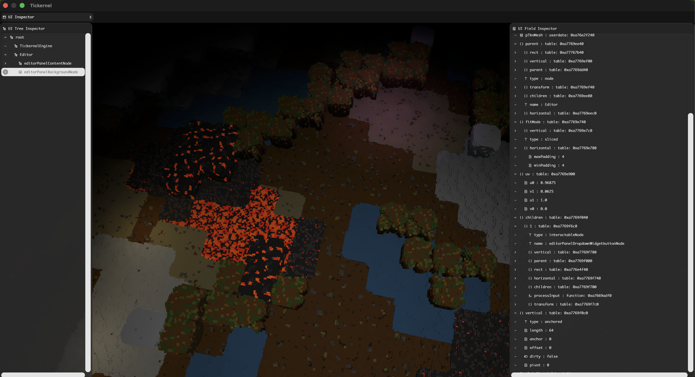
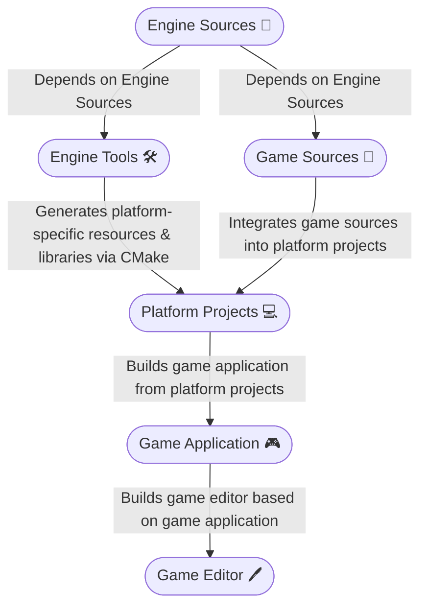

# Tickernel ⚙

> A voxel game engine built on clean C99 + Lua, with a fully runtime-scriptable render pipeline and a lightweight retained-mode UI framework.

Tickernel renders voxel worlds through a **deferred Vulkan pipeline**, using point-topology GPU primitives for maximum draw-call efficiency. All high-level logic — rendering, scene management, UI, and game systems — is defined in **Lua scripts** loaded at runtime, so nothing requires a recompile to change.





---

## Key Features

### Runtime-Scriptable Render Pipeline (SRP)

Every Vulkan concept — attachments, render passes, subpasses, pipelines, descriptor sets, materials — is **constructed and torn down from Lua at runtime**. Swapping or extending the render pipeline never requires touching or recompiling C code.

- **Deferred renderer out of the box**: a two-subpass Vulkan render pass (Geometry → Lighting) with albedo, normal, and depth G-buffer targets.
- **Point-sprite voxel geometry**: voxels are submitted as `VK_PRIMITIVE_TOPOLOGY_POINT_LIST`. Screen-space point size is derived from the projection's focal length, giving physically correct coverage at any resolution.
- **Full-screen lighting pass**: reads G-buffer input attachments directly within a Vulkan subpass, avoiding intermediate copies. Supports a directional light + up to 128 point lights.
- **Automatic shader reflection**: SPIRV-Reflect inspects every shader's SPIR-V bytecode at load time to wire descriptor set layouts and vertex attributes automatically — add a new uniform in GLSL and the engine binds it without any manual declaration.
- **Three-tier material system**: global (camera/time UBO at set 0), subpass (G-buffer inputs at set 1), pipeline (per-object resources at set 2).

### TGUI — Lightweight Retained-Mode UI

TGUI is a fully Lua-driven UI system with its own Vulkan render pass and instanced draw pipeline. It is designed around a clean node tree with minimal boilerplate.

- **Flexible layout engine**: every node supports two layout modes per axis — `anchored` (fixed size + anchor/pivot positioning) and `relative` (stretch-to-fill with min/max offsets). Integer values are interpreted as pixels; float values as NDC fractions.
- **Dirty-flag propagation**: model matrices are only recomputed when a node or one of its ancestors changes, keeping per-frame CPU overhead minimal.
- **Color inheritance**: RGBA colors propagate multiplicatively down the tree, enabling global tint and alpha fade with zero per-node overhead.
- **Stencil-based clipping**: scroll views clip their children using the stencil buffer — no shader-side clip planes or texture readbacks.
- **Instanced rendering**: position, orientation, and color for every node are packed into a single instance buffer and submitted in one draw call per pipeline.
- **Rich widget library**: Button, Toggle, Slider, Dropdown, InputField, ScrollView, DraggableWindow, TreeNode — all implemented in Lua on top of the core node API.
- **Live inspector panels**: a built-in Lua table tree-view inspector and a UI node inspector let you browse and inspect runtime state without pausing or restarting.

### Voxel World Systems

- **Custom TVOX format**: compact binary encoding of voxel grids (`uint16` position + `uint32` color + packed normal + PBR channels). MagicaVoxel `.vox` files convert automatically at import.
- **Quaternion scene graph**: hierarchical transforms with dirty-flag propagation; model matrices computed top-down only when marked dirty.
- **Biome generation**: a 2D temperature/humidity space covering seven biomes (snow, ice, sand, grass, water, lava, volcanic).
- **Deterministic structure placement**: Cantor-pair seeding + LCG random for placement rotation, producing the same world from the same seed.
- **PBR voxel material palette**: named presets (dirt, rock, grass, lava, ice, crystal, …) carrying RGBA, emissive, roughness, and metallic packed into the vertex stream.

### Minimal, Auditable Dependencies

| Library | Purpose |
|---|---|
| **Vulkan** | GPU API |
| **Lua 5.x** | Scripting runtime (bundled) |
| **cglm** | SIMD-accelerated math (bundled) |
| **FreeType** | Font rasterization for TGUI text (bundled) |
| **SPIRV-Reflect** | Runtime shader introspection (bundled) |
| **glslc** | GLSL → SPIR-V compilation (build-time) |
| **astcenc** | Texture → ASTC compression (build-time, optional) |

No runtime dependencies beyond a Vulkan-capable driver and a C99 compiler.

---

## Architecture

### C Layer — Core (`tkn/`)

The C layer is the engine's foundation. It compiles to `libTickernel` and owns every Vulkan object lifetime.

```
tkn/
  include/
    tkn.h                ← public C API — all opaque types and functions
  src/
    tknGfxContext.c      ← device selection, swapchain, queue, frame acquire/submit/present
    tknRenderPass.c      ← render pass + subpass creation; auto-binds input attachments via SPIRV-Reflect
    tknPipeline.c        ← pipeline creation; SPIRV-Reflect vertex input layout wiring
    tknMaterial.c        ← descriptor set management, material bind/unbind
    tknMesh.c            ← vertex buffer upload and update
    tknInstance.c        ← per-instance data buffer (model matrices, etc.)
    tknImage.c           ← image creation, staging upload, partial updates
    tknAstc.c            ← ASTC file parsing
    tknDrawCall.c        ← draw call assembly (pipeline + material + mesh + instance)
    tknCore.c            ← TknDynamicArray, TknHashSet, tknMalloc/tknFree, assert/warn
    tknGfxCore.h         ← internal struct definitions
```

### Lua Layer — High-Level Logic (`assets/lua/`)

All engine and game logic lives here. Nothing in this layer requires a recompile to change.

```
assets/lua/
  tknEngine.lua          ← main loop: start / update / recordFrame / stop
  tkn.lua                ← C API bindings, Vulkan presets, helpers
  vulkan.lua             ← Vulkan enum constants
  tknMath.lua            ← matrix / vector / noise / LCG utilities
  game/
    deferredRenderer/    ← deferred render pass + geometry/lighting pipelines
    tknVoxel.lua         ← TVOX I/O + mesh builder
    transformSystem.lua  ← quaternion scene graph
    cameraSystem.lua     ← view/projection matrices
    groundSystem.lua     ← biome placement
    structureSystem.lua  ← structure instance map
    voxelConfig.lua      ← PBR material palette
  ui/
    ui.lua               ← TGUI node tree + layout engine
    uiRenderPass.lua     ← UI Vulkan render pass + pipeline
  engine/
    widgets/             ← Button, Toggle, Slider, Dropdown, InputField, …
    panels/              ← Editor inspector panels
```

---

## Engineering Philosophy

### Naming
Function names use camelCase. Loop indices must be descriptive (`deviceIndex`, not `i`) — disambiguation matters in deeply nested code.

### Performance by Default
Conditional checks belong at system boundaries, not scattered through hot paths. Unnecessary guards slow down the runtime and inflate code size without providing safety.

### API Surface Discipline
All GFX functions are **parameter-based**: they accept typed arguments and construct `VkCreateInfo` structures internally. Raw `CreateInfo` structs are never exposed as public API parameters.